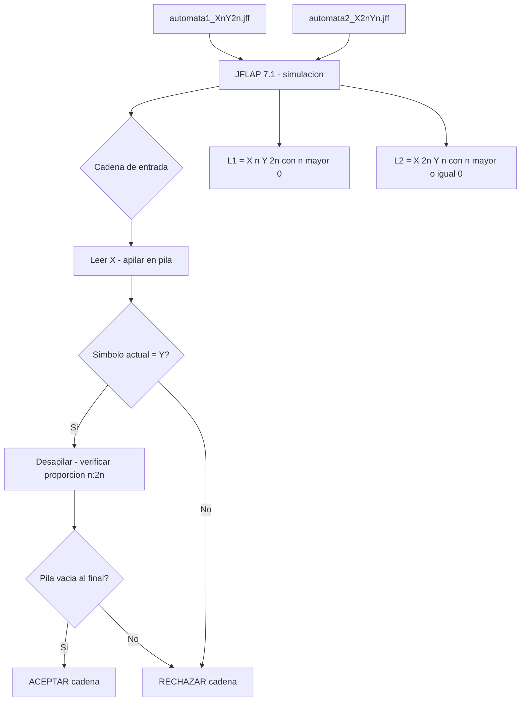

<div align="center">

# Autómata a Pila con JFLAP

[](https://opensource.org/licenses/MIT)
[](http://www.jflap.org/)
[](https://www.java.com/)

## 📋 Descripción del Proyecto

</div>

---

Este repositorio contiene la implementación completa de dos autómatas a pila (PDA - Pushdown Automata) desarrollados como parte del **Laboratorio #2** de la asignatura **Teoría de Autómatas y Lenguajes Formales**. El proyecto demuestra el reconocimiento de lenguajes libres de contexto que requieren memoria auxiliar mediante estructuras de datos tipo pila.

### Lenguajes Implementados

1. **Autómata 1:** L₁ = {X<sup>n</sup>Y<sup>2n</sup> : n > 0}
   - Reconoce cadenas donde cada X debe estar seguida por exactamente el doble de Y's
   - Ejemplos válidos: `XYY`, `XXYYYY`, `XXXYYYYYY`

2. **Autómata 2:** L₂ = {X<sup>2n</sup>Y<sup>n</sup> : n ≥ 0}
   - Reconoce cadenas con exactamente el doble de X's que de Y's
   - Incluye aceptación de la cadena vacía (ε)
   - Ejemplos válidos: `ε`, `XXY`, `XXXXYY`, `XXXXXXYYY`

---

## 🎯 Objetivos del Proyecto

- Diseñar e implementar autómatas a pila para lenguajes libres de contexto
- Comprender las operaciones fundamentales de pila (push y pop)
- Analizar estrategias de reconocimiento basadas en balance y conteo
- Validar experimentalmente el comportamiento de los autómatas mediante pruebas exhaustivas
- Documentar formalmente el proceso de diseño e implementación

---

## 🛠️ Tecnologías y Herramientas

- **JFLAP 7.1** - Java Formal Languages and Automata Package
- **Java Runtime Environment (JRE) 8+** - Requerido para ejecutar JFLAP
- **Multiple Character Input PDA** - Modalidad de autómata a pila utilizada

---

## 📁 Estructura del Repositorio
```
Automata_a_pila/
│
├── README.md                                    # Este archivo
├── Autómata a pila con JFLAP + Alejandro De Mendoza.pdf  # Documentación completa
│
├── automatas/
│   ├── automata1_XnY2n.jff                     # Autómata 1: X^n Y^(2n)
│   └── automata2_X2nYn.jff                     # Autómata 2: X^(2n) Y^n
│
└── docs/
    ├── imagenes/                                # Capturas de pantalla
    └── diagramas/                               # Diagramas de estados
```

---

## 🚀 Instalación y Configuración

### Requisitos Previos

1. **Java Runtime Environment (JRE)**
```bash
   # Verificar instalación de Java
   java -version
```
   Si no está instalado, descargarlo desde: https://www.java.com/es/download/

2. **JFLAP 7.1**
   - Descargar desde: http://www.jflap.org/jflaptmp/
   - Archivo: `JFLAP7.1.jar`

### Ejecución

1. **Ejecutar JFLAP:**
```bash
   java -jar JFLAP7.1.jar
```

2. **Abrir un autómata:**
   - File → Open
   - Seleccionar el archivo `.jff` deseado

3. **Probar cadenas:**
   - Input → Multiple Run (para múltiples cadenas)
   - Input → Step by State (para ejecución paso a paso)

---

## 🔧 Especificaciones Técnicas

### Autómata 1: L₁ = {X<sup>n</sup>Y<sup>2n</sup> : n > 0}

#### Componentes
- **Estados:** q0, q1, q2, q3, q4 (5 estados)
- **Estado inicial:** q0
- **Estado final:** q4
- **Alfabeto de entrada:** Σ = {X, Y}
- **Alfabeto de pila:** Γ = {Z, a}
- **Símbolo inicial de pila:** Z

#### Estrategia de Reconocimiento
1. Por cada **X** leída → apilar **UN** símbolo `a`
2. Por cada **DOS Y's** leídas → desapilar **UN** símbolo `a`
3. Al final, verificar que la pila solo contenga `Z`

#### Transiciones Clave

| Origen | Destino | Read | Pop | Push | Descripción |
|--------|---------|------|-----|------|-------------|
| q0 | q1 | X | Z | aZ | Lee primera X, apila 'a' sobre Z |
| q1 | q1 | X | a | aa | Lee más X's, apila 'a' adicional |
| q1 | q2 | Y | a | a | Lee primera Y, mantiene 'a' |
| q2 | q3 | Y | a | ε | Lee segunda Y, desapila 'a' |
| q3 | q2 | Y | a | a | Reinicia conteo para más Y's |
| q3 | q4 | ε | Z | Z | Transición épsilon al estado final |

### Autómata 2: L₂ = {X<sup>2n</sup>Y<sup>n</sup> : n ≥ 0}

#### Componentes
- **Estados:** q0, q1, q2, q3, q4 (5 estados)
- **Estado inicial:** q0
- **Estado final:** q4
- **Alfabeto de entrada:** Σ = {X, Y}
- **Alfabeto de pila:** Γ = {Z, a}
- **Símbolo inicial de pila:** Z

#### Estrategia de Reconocimiento
1. Aceptar la **cadena vacía** mediante transición épsilon
2. Por cada **PAR de X's** leídas → apilar **UN** símbolo `a`
3. Por cada **Y** leída → desapilar **UN** símbolo `a`
4. Al final, verificar que la pila solo contenga `Z`

#### Transiciones Clave

| Origen | Destino | Read | Pop | Push | Descripción |
|--------|---------|------|-----|------|-------------|
| q0 | q4 | ε | Z | Z | Acepta cadena vacía directamente |
| q0 | q1 | X | Z | Z | Lee primera X (impar) sin apilar |
| q1 | q2 | X | Z | aZ | Lee segunda X (par), apila 'a' |
| q2 | q1 | X | a | aa | Lee X par adicional, apila 'a' |
| q2 | q3 | Y | a | ε | Comienza a leer Y's, desapila |
| q3 | q3 | Y | a | ε | Continúa leyendo Y's |
| q3 | q4 | ε | Z | Z | Transición épsilon al estado final |

---

## 🧪 Casos de Prueba

### Autómata 1 - Cadenas Aceptadas ✅

| # | Cadena | n | Análisis |
|---|--------|---|----------|
| 1 | XYY | 1 | 1 X → 2 Y's |
| 2 | XXYYYY | 2 | 2 X's → 4 Y's |
| 3 | XXXYYYYYY | 3 | 3 X's → 6 Y's |
| 4 | XXXXYYYYYYYY | 4 | 4 X's → 8 Y's |
| 5 | XXXXXXXXXXYYYYYYYYYYYY | 10 | 10 X's → 20 Y's |

### Autómata 1 - Cadenas Rechazadas ❌

| # | Cadena | Razón |
|---|--------|-------|
| 1 | XY | Solo 1 Y, necesita 2 |
| 2 | XXY | 2 X's requieren 4 Y's |
| 3 | XYYY | 3 Y's no es múltiplo de 2 |
| 4 | XXXYYYY | 3 X's requieren 6 Y's |
| 5 | YY | Comienza con Y sin X |

### Autómata 2 - Cadenas Aceptadas ✅

| # | Cadena | n | Análisis |
|---|--------|---|----------|
| 1 | ε | 0 | Cadena vacía (n=0) |
| 2 | XXY | 1 | 2 X's → 1 Y |
| 3 | XXXXYY | 2 | 4 X's → 2 Y's |
| 4 | XXXXXXYYY | 3 | 6 X's → 3 Y's |
| 5 | XXXXXXXXYYYY | 4 | 8 X's → 4 Y's |

### Autómata 2 - Cadenas Rechazadas ❌

| # | Cadena | Razón |
|---|--------|-------|
| 1 | X | X impar sin par |
| 2 | XY | Solo 1 X, necesita 2 |
| 3 | XXXYY | 3 X's (impar) para 2 Y's |
| 4 | XXXYYY | 3 X's requieren 1.5 Y's |
| 5 | XXYYYY | 2 X's solo requieren 1 Y |

---

## 📊 Análisis Comparativo

| Característica | Autómata 1 (X<sup>n</sup>Y<sup>2n</sup>) | Autómata 2 (X<sup>2n</sup>Y<sup>n</sup>) |
|----------------|-------------------------------------------|-------------------------------------------|
| Estrategia | Apilar por X, desapilar por 2 Y's | Apilar por 2 X's, desapilar por Y |
| Cadena vacía | ❌ No acepta (n > 0) | ✅ Acepta (n ≥ 0) |
| Complejidad | Conteo de pares de Y's | Alternancia X impar/par |
| Estados | 5 estados | 5 estados |
| Dificultad | Media-Alta | Media-Alta |

---

## 🎓 Conceptos Teóricos Aplicados

### Operaciones de Pila
- **Push (Apilar):** Agregar símbolos a la pila
- **Pop (Desapilar):** Remover símbolos de la pila
- **LIFO (Last In, First Out):** Último en entrar, primero en salir

### Elementos del PDA
- **Transiciones épsilon (λ):** Transiciones sin leer símbolo de entrada
- **Símbolo de fondo (Z):** Marcador de pila vacía
- **Aceptación por estado final:** Alcanzar estado final con pila verificada
- **Alfabeto de pila (Γ):** Símbolos que pueden almacenarse en la pila

### Jerarquía de Chomsky
Los autómatas a pila reconocen **lenguajes libres de contexto (Tipo 2)**, situándose entre:
- **Lenguajes regulares** (Tipo 3) - Reconocidos por autómatas finitos
- **Lenguajes recursivamente enumerables** (Tipo 0) - Reconocidos por máquinas de Turing

---

## 🔍 Desafíos y Soluciones

### Desafío 1: Single vs Multiple Character Input
**Problema:** JFLAP ofrece dos modalidades de PDA con restricciones diferentes.

**Solución:** Después de pruebas infructuosas con "Single Character Input" (permite apilar solo UN carácter), se determinó usar "Multiple Character Input" que permite operaciones como `push: aZ` o `push: aa`.

### Desafío 2: Formato de Transiciones
**Problema:** Formato inicial con notación `X,Z;aZ` no funcionaba.

**Solución:** JFLAP requiere tres campos separados:
- Campo 1: Read from tape
- Campo 2: Pop from stack  
- Campo 3: Push to stack

### Desafío 3: Conteo de Pares
**Problema:** Contar Y's de dos en dos requiere estados intermedios.

**Solución:** Implementar mecanismo q2 ↔ q3 para alternar entre primera y segunda Y de cada par.

---

## 📚 Aplicaciones Prácticas

Los autómatas a pila son fundamentales en:

1. **Compiladores:** Análisis sintáctico de lenguajes de programación
2. **Procesadores XML/HTML:** Validación de etiquetas balanceadas
3. **Expresiones matemáticas:** Verificación de paréntesis balanceados
4. **Analizadores léxicos:** Reconocimiento de estructuras anidadas
5. **Sistemas de validación:** Verificación de formatos con dependencias contextuales

---

## 👨‍💻 Autor

**Alejandro De Mendoza Tovar**
- Ingeniería Informática
- Fundación Universitaria Internacional de La Rioja (UNIR)
- Bogotá D.C., Colombia

---

## 📄 Licencia

Este proyecto está bajo la Licencia MIT. Ver el archivo `LICENSE` para más detalles.

---

## 🙏 Agradecimientos

Especial agradecimiento al **Ing. Rogerio Orlando Beltrán Castro**, profesor de Teoría de Autómatas y Lenguajes Formales, por su guía, paciencia y dedicación durante el desarrollo de este laboratorio. Sus enseñanzas han sido fundamentales para comprender los conceptos de lenguajes libres de contexto y su aplicación práctica.

---

## 📞 Contacto y Soporte

Para preguntas, sugerencias o reportar problemas:
- 📧 Email: [contacto disponible en GitHub]
- 🐛 Issues: [GitHub Issues](https://github.com/AlejoTechEngineer/Automata_a_pila/issues)
- 💬 Discussions: [GitHub Discussions](https://github.com/AlejoTechEngineer/Automata_a_pila/discussions)

---

## 📅 Información del Proyecto

- **Fecha de inicio:** Noviembre 2025
- **Fecha de finalización:** 22 de Noviembre de 2025
- **Versión:** 1.0.0
- **Estado:** ✅ Completado

---

## 🔗 Referencias

- Hopcroft, J. E., Motwani, R., & Ullman, J. D. (2006). *Introduction to Automata Theory, Languages, and Computation* (3.ª ed.). Pearson Education.
- Sipser, M. (2013). *Introduction to the Theory of Computation* (3.ª ed.). Cengage Learning.
- JFLAP Official Website: http://www.jflap.org/
- JFLAP Tutorial: http://www.jflap.org/tutorial/

---

<div align="center">

**⭐ Si este proyecto te fue útil, considera darle una estrella ⭐**

[](https://github.com/AlejoTechEngineer/Automata_a_pila)

---

Hecho con ❤️ y ☕ por Alejandro De Mendoza

</div>
## Arquitectura


